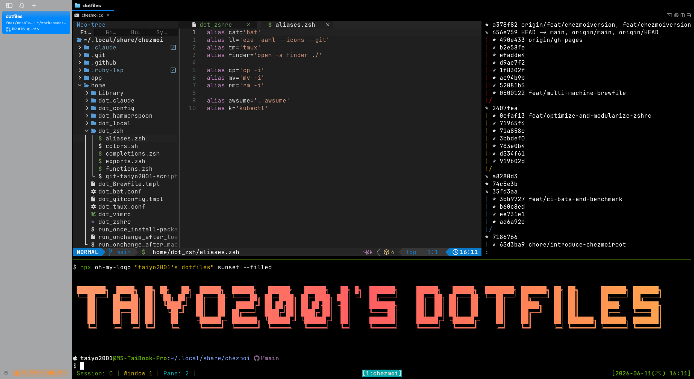

<div align="center">

# 🏠 dotfiles

[](https://github.com/taiyo2001/dotfiles/actions/workflows/push_ci.yml)
[](https://www.chezmoi.io/)
[](https://taiyo2001.github.io/dotfiles/)

macOS 向け dotfiles。[chezmoi](https://www.chezmoi.io/) + [1Password CLI](https://developer.1password.com/docs/cli/) で機密情報を安全に管理し、[mise](https://mise.jdx.dev/) でランタイムバージョンを統一。個人 / 仕事マシンの分岐にも対応。

> **Note:** これらの設定は自分の環境に合わせたものです。盲目的に使わず、内容を確認してから適用してください。



</div>

## 技術スタック

<table width="100%">
  <thead>
    <tr>
      <th align="left">カテゴリ</th>
      <th align="left">ツール</th>
    </tr>
  </thead>
  <tbody>
    <tr><td>dotfiles 管理</td><td><a href="https://www.chezmoi.io/">chezmoi</a></td></tr>
    <tr><td>シークレット管理</td><td><a href="https://developer.1password.com/docs/cli/">1Password CLI</a></td></tr>
    <tr><td>バージョン管理</td><td><a href="https://mise.jdx.dev/">mise</a></td></tr>
    <tr><td>パッケージ管理</td><td><a href="https://brew.sh/">Homebrew</a></td></tr>
    <tr><td>シェル</td><td>zsh + <a href="https://github.com/zsh-users/zsh-autosuggestions">zsh-autosuggestions</a> + <a href="https://github.com/zsh-users/zsh-syntax-highlighting">zsh-syntax-highlighting</a></td></tr>
    <tr><td>プロンプト</td><td><a href="https://starship.rs/">Starship</a></td></tr>
    <tr><td>エディタ</td><td><a href="https://neovim.io/">Neovim</a></td></tr>
    <tr><td>ターミナルマルチプレクサ</td><td><a href="https://github.com/tmux/tmux">tmux</a></td></tr>
    <tr><td>Git フック</td><td><a href="https://github.com/evilmartians/lefthook">lefthook</a></td></tr>
  </tbody>
</table>

## 構成

<table width="100%">
  <thead>
    <tr>
      <th align="left">ディレクトリ</th>
      <th align="left">内容</th>
    </tr>
  </thead>
  <tbody>
    <tr><td><code>home/</code></td><td>chezmoi 管理の dotfiles（<code>dot_*</code> / <code>run_*</code>）</td></tr>
    <tr><td><code>home/dot_zsh/</code></td><td>zsh モジュール（exports / aliases / functions / completions）</td></tr>
    <tr><td><code>app/</code></td><td>アプリケーション別セットアップ手順</td></tr>
    <tr><td><code>tests/</code></td><td>Bats スモークテスト</td></tr>
  </tbody>
</table>

## セットアップ（新規マシン）

### 1. Homebrew をインストール

```sh
/bin/bash -c "$(curl -fsSL https://raw.githubusercontent.com/Homebrew/install/HEAD/install.sh)"
```

> Xcode Command Line Tools（git 含む）も同時にインストールされます。

### 2. chezmoi・1Password・make をインストール

```sh
brew install chezmoi make
brew install --cask 1password 1password-cli
```

### 3. 1Password CLI にサインイン

1. 1Password アプリを起動してアカウントにサインイン
2. **設定** → **開発者** → **「1Password CLIと統合」をオン**
3. ターミナルで認証：

```sh
eval $(op signin)
```

### 4. dotfiles リポジトリをクローン

```sh
chezmoi init taiyo2001
```

リポジトリが `~/.local/share/chezmoi/` にクローンされます（この時点ではまだ適用しません）。

### 5. 1Password アイテムをセットアップ

`Private` vault に `dotfiles` アイテムを作成します：

```sh
make -C ~/.local/share/chezmoi op/setup
```

以下のフィールドへの入力を求められます：

<table width="100%">
  <thead>
    <tr>
      <th align="left">フィールド名</th>
      <th align="left">内容</th>
    </tr>
  </thead>
  <tbody>
    <tr><td><code>git config email</code></td><td>git のメールアドレス</td></tr>
    <tr><td><code>git config signingkey</code></td><td>git 署名キー（GPG key ID）</td></tr>
    <tr><td><code>claude code org_uuid</code></td><td>Claude Code org UUID</td></tr>
  </tbody>
</table>

### 6. dotfiles を適用

> **Warning:** Finder・Dock などの **macOS システム設定が変更されます。** 各ステップで yes/no を確認してから適用してください。

```sh
make -C ~/.local/share/chezmoi setup/apply
```

以下が順に実行されます（各ステップで確認プロンプトあり）：

- Homebrew パッケージ（Brewfile）のインストール
- macOS システム設定の変更
- `lefthook install` による Git フックのセットアップ

### アプリケーションごとのセットアップ

[こちら](./app/README.md)を参照

---

## dotfilesの編集フロー

```sh
# ソースディレクトリに移動して編集
chezmoi cd

# ホームのファイルを編集した後、ソースに反映
chezmoi re-add ~/.hammerspoon/init.lua

# 差分確認
chezmoi diff

# 適用
chezmoi apply
```

---

## 動作確認用のDocker環境

```sh
make docker/setup
make docker/exec-zsh
```

## CI / 品質チェック

### ローカルで全チェックを実行

```sh
make ci/local
```

shfmt・shellcheck・テンプレート変数チェック・Bats スモークテストを一括実行します。

### pre-push フック

`git push` 時に自動で `make ci/local` と同等のチェックが実行されます（lefthook）。
`make setup/apply` 実行時に `lefthook install` も同時に行われるため、追加の作業は不要です。

